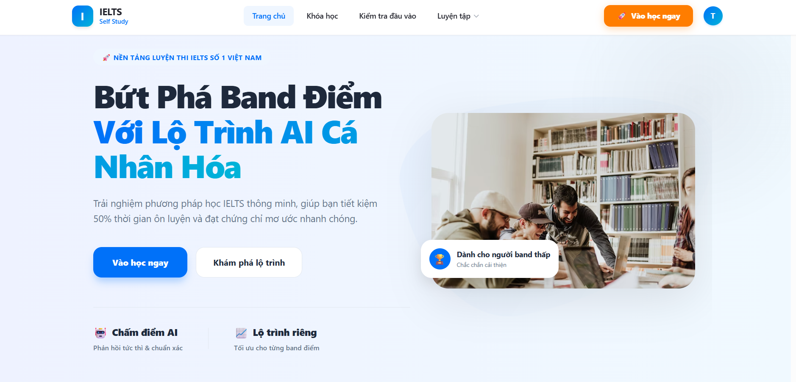
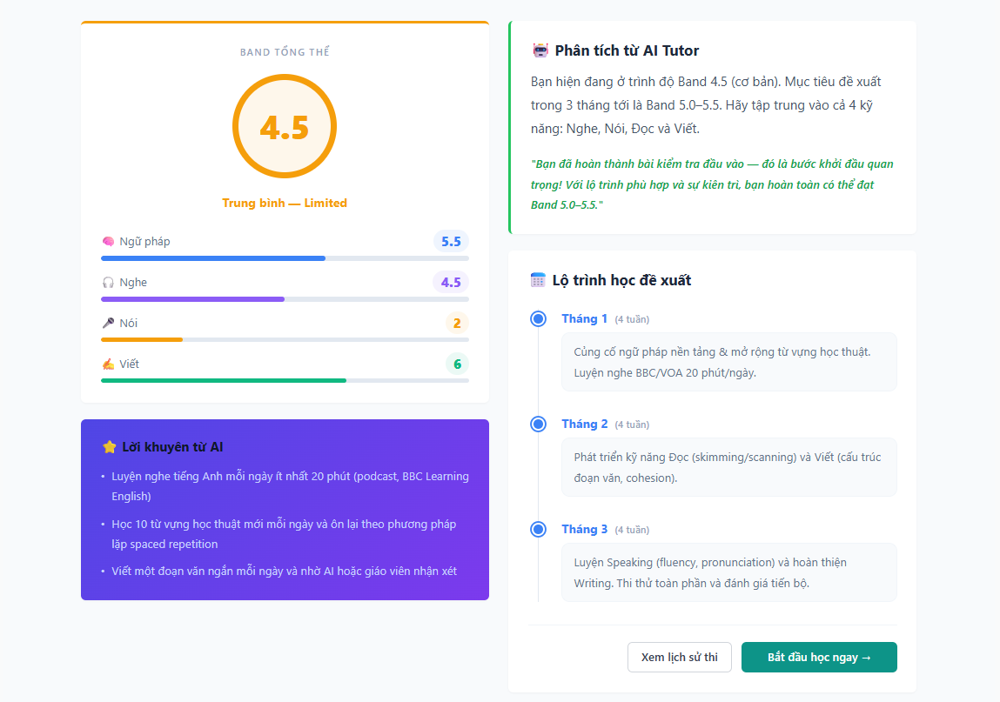
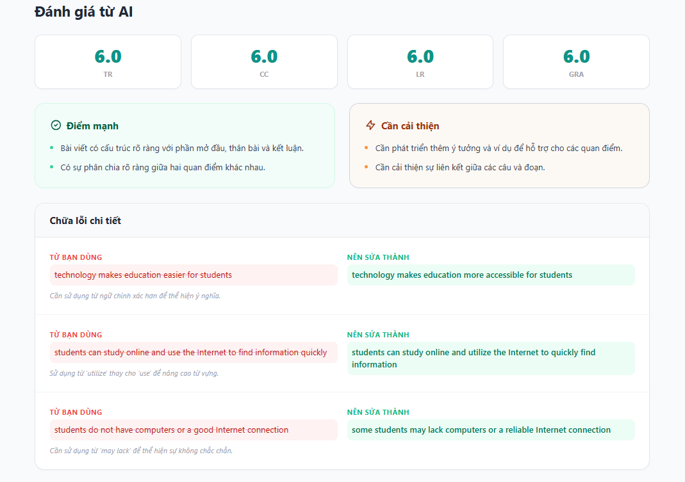
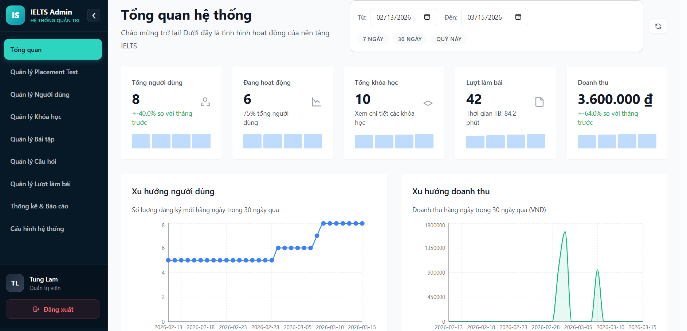

<h1 align="center">
  <br>
  
  <br>
  IELTS Self-Study Platform
  <br>
</h1>

<h4 align="center">An Enterprise-grade IELTS preparation platform powered by AI and built with Clean Architecture.</h4>

<div align="center">
  <a href="https://ieltsstudy.vercel.app" target="_blank">
    
  </a>
</div>
<br>

<p align="center">
  
  
  
  
  
  <br/>
  
  
  
  
</p>

## 📌 Overview
This project is an automated IELTS self-study system designed to help learners (Band 3.5 - 6.0+) improve their 4 skills: Reading, Listening, Speaking, and Writing. The system leverages **OpenAI (GPT-4o-mini & Whisper)** for real-time grading, speech-to-text conversion, and providing highly personalized feedback for subjective skills like Speaking and Writing.

The backend is strictly built upon **Clean Architecture** patterns, ensuring high maintainability, testability, and separation of concerns. The entire project is integrated with CI/CD and fully deployed on Cloud platforms.

## ✨ Key Features
- **🤖 AI-Powered Grading:** Automated grading for Writing and Speaking tests with detailed grammar correction and vocabulary suggestions (OpenAI integration).
- **🗣️ Speech-to-Text Analysis:** Real-time audio recording and transcription using the Whisper model.
- **📈 Personalized Roadmap:** Dynamic Placement Test workflow that evaluates the user's overall band and generates a month-by-month study roadmap.
- **🔐 Robust Security:** Role-based Access Control (RBAC) with secure JWT Authentication & Refresh Tokens.
- **☁️ Cloud & CDN Storage:** Seamless multi-media file upload management using Cloudinary.
- **☁️ Full Cloud Deployment:** Backend API hosted on Render, Frontend deployed via Vercel, and Database running on SmarterASP.

## 🏗️ System Architecture (Clean Architecture)
The backend enforces **Clean Architecture** principles to maintain a highly scalable and loosely coupled structure:
1. **Domain Layer:** Contains core business entities (`User`, `Course`, `Attempt`, etc.) and custom exceptions. *(No dependencies)*
2. **Application Layer:** Contains business logic, Use Cases, CQRS/Services, DTOs, and Repository Interfaces.
3. **Infrastructure Layer:** Implements Data Access (Entity Framework Core), External Services (OpenAI HTTP Clients, Cloudinary).
4. **Presentation/API Layer:** HTTP endpoints (Controllers, Middlewares, Output Caching) interacting seamlessly with the Client.

## 🚀 Live Environment & Deployment
- **Frontend Panel:** Deployed continuously (CI/CD) on **[Vercel](https://ieltsstudy.vercel.app)**
- **Backend API:** Hosted on **Render CI/CD Pipeline**
- **Database:** Cloud SQL Server hosted on **SmarterASP.net**

## 💻 Local Setup (Development)

### Prerequisites
- [.NET 8 SDK](https://dotnet.microsoft.com/download/dotnet/8.0)
- [Node.js](https://nodejs.org/) (v18+) & `npm`
- SQL Server (LocalDB or Docker)

### Backend Setup
1. Clone the repository and navigate to the API directory:
   ```bash
   cd IeltsSelfStudy.Api
   ```
2. Update the `appsettings.json` with your credentials:
   - Database Connection String
   - JWT Secret Key & Expiry
   - OpenAI API Key
   - Cloudinary Configuration
3. Run Entity Framework Migrations & Update DB:
   ```bash
   dotnet ef database update
   ```
4. Run the API Server:
   ```bash
   dotnet run
   ```

### Frontend Setup
1. Navigate to the client SPA directory:
   ```bash
   cd frontend/ielts-selfstudy-client
   ```
2. Install NodeJS dependencies:
   ```bash
   npm install
   ```
3. Start the Vite development server:
   ```bash
   npm run dev
   ```

## 📸 Screenshots Gallery
| Landing Page | Placement Test & Roadmap |
| :---: | :---: |
|  |  |

| AI Writing Feedback | Admin Dashboard |
| :---: | :---: |
|  |  |

## 👨‍💻 Author
**Lê Tùng Lâm** - Software Engineer (`.NET` / `React`)
- Email: tuglam1164@gmail.com
- GitHub: [@LeTungLam-116](https://github.com/LeTungLam-116)

---
⭐️ *If you found this software architecture or implementation helpful, feel free to give this repository a star!*
